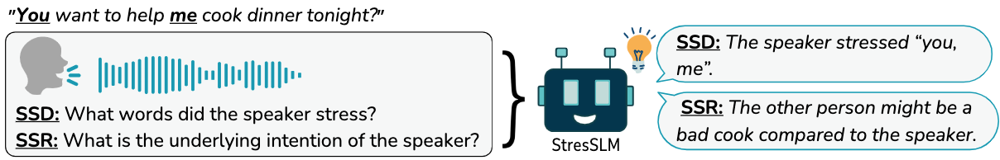

# StressTest
**Official repository of the paper:**

*StressTest: Can YOUR Speech LM Handle the Stress?*

<p align="center">
    🌐 <a href="https://pages.cs.huji.ac.il/adiyoss-lab/stresstest/" target="_blank">Project</a> | 📃 <a href="https://arxiv.org/abs/2505.22765" target="_blank">Paper</a> | 🤗 <a href="https://huggingface.co/datasets/slprl/StressTest" target="_blank">StressTest Dataset </a><br> | 🤗 <a href="https://huggingface.co/slprl/StresSLM" target="_blank">StresSLM Model</a>
</p>


This repository provides code for evaluating **Sentence Stress Detection (SSD)** and **Sentence Stress Reasoning (SSR)** on ***StressTest*** benchmark. 

It includes:

* Evaluation of our proposed model **StresSLM**.
* Examples to run evaluation with two additional models.

<p align="center">
  
</p>

Training code coming soon...

---

## 🚀 Getting Started

### 🔧 Installation

Clone the repository and install the dependencies:

```bash
git clone https://github.com/slp-rl/StressTest.git
cd StressTest
pip install -r requirements.txt
```

---

## 📊 Evaluation


### ✅ Running the Evaluations

We evaluate models using our judgment-based protocol. You’ll need an OpenAI API key for the judge (e.g., GPT-4) evaluation. Set the key as an environment variable:

```bash
export OPENAI_API_KEY=your_openai_api_key
```

altenatively, you can set the key in the `stresstest/evaluation/configs.py` file:

```python
class Settings(BaseSettings):
    OPENAI_API_KEY: str = "your_openai_api_key"
```

Then run the evaluation script:

```bash
python -m stresstest.evaluation.main \
    --task ssr \
    --model_to_evaluate stresslm
```

You can change the `--task` flag to `ssd` for the Sentence Stress Detection task.
`--model_to_evaluate` can be one of the following `["stresslm", "qwen2audio", "gpt-4o-audio", "mock"]`.

the script will create a `results/` directory at the project root to store evaluation outputs.
The expected project structure is:

```
StressTest
├── infra
├── stresstest
│   └── evaluation
└── results
```


---

### 🤔 Evaluating Your Own Model

To evaluate your own model, implement it using the following interface and place it under the stresstest/evaluation/src/inference directory:
```python
from abc import ABC, abstractmethod

class InferenceClientBase(ABC):

    @abstractmethod
    def prepapre(self, *args, **kwargs) -> dict:
        """
        Prepare method to be implemented by subclasses. 
        This method should return a dictionary with the necessary inputs for the predict method.
        The returned ditionary is handled by the evaluation script.
        """
        pass

    @abstractmethod
    def predict(self, *args, **kwargs) -> str:
        """Predict method to be implemented by subclasses."""
        pass
```

Then, register your model by updating the configs.py and clients.py files in the stresstest/evaluation folder. Make sure your new model is included as a valid option for the --model_to_evaluate argument.

---

## 🏋️‍♂️ Training (Coming Soon)

We will release:

* The synthetic training data `Stress-17K` used to train StresSLM.
* The training script for finetuning on SSD and SSR.

Stay tuned!

---

## 📖 Citation

If you use this work, please cite our paper:

```bibtex
Soon.
```
