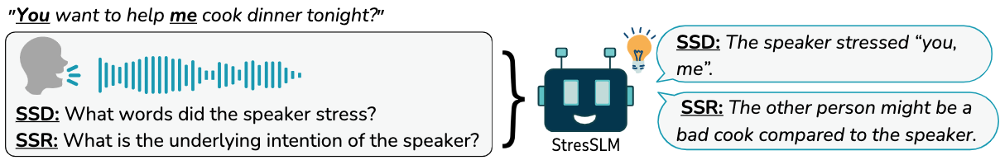

# StressTest
**Official repository of the paper:**

*StressTest: Can YOUR Speech LM Handle the Stress?*

<p align="center">
    🌐 <a href="https://pages.cs.huji.ac.il/adiyoss-lab/stresstest/" target="_blank">Project</a> | 📃 <a href="https://arxiv.org/abs/2505.22765" target="_blank">Paper</a> | 🤗 <a href="https://huggingface.co/datasets/slprl/StressTest" target="_blank">StressTest Dataset </a><br> | 🤗 <a href="https://huggingface.co/slprl/StresSLM" target="_blank">StresSLM Model</a>
</p>


This repository provides code for evaluating **Sentence Stress Detection (SSD)** and **Sentence Stress Reasoning (SSR)** on ***StressTest*** benchmark. 

It includes:

* Evaluation of our proposed model **StresSLM**.
* Examples to run evaluation with two additional models.

It also includes **Stress-17K** training data loading and augmentation script used to train **StresSLM** and a staged sft script example to train your own stress-aware model.

<p align="center">
  
</p>

---

## 🚀 Getting Started

### 🔧 Installation

Clone the repository and install the dependencies:

```bash
git clone https://github.com/slp-rl/StressTest.git
cd StressTest
pip install -r requirements.txt
```

---

## 📊 Evaluation


### ✅ Running the Evaluations

We evaluate models using our judgment-based protocol. You’ll need an OpenAI API key for the judge (e.g., GPT-4) evaluation. Set the key as an environment variable:

```bash
export OPENAI_API_KEY=your_openai_api_key
```

altenatively, you can set the key in the `stresstest/evaluation/configs.py` file:

```python
class Settings(BaseSettings):
    OPENAI_API_KEY: str = "your_openai_api_key"
```

Then run the evaluation script:

```bash
python -m stresstest.evaluation.main \
    --task ssr \
    --model_to_evaluate stresslm
```

The `--task` flag supports three options:

SSR - Sentence Stress Reasoning:
- `ssr_accuracy` — binary-choice SSR. Evaluates whether the model selects the correct answer (1–2).
- `open_ssr` — open-ended SSR. A GPT-4o judge scores the model's free-form explanation of stress meaning.

SSD - Sentence Stress Detection.
- `ssd` — Evaluates which words the model identifies as stressed (precision/recall/F1).

All available flags:

| Flag | Choices / Default | Description |
|---|---|---|
| `--task` | `ssr_accuracy`, `open_ssr`, `ssd` | Evaluation task |
| `--model_to_evaluate` | `stresslm`, `qwen2audio`, `gpt-4o-audio`, `mock` | Model to evaluate |
| `--ds_name` | `stresstest` (default), `stresspresso` | Benchmark dataset |
| `--evaluator_type` | `judge` (default), `stresslm_custom` | `judge` uses GPT-4o to score outputs; `stresslm_custom` uses regex-based parsing (no API key required) |
| `--stresslm_model_checkpoint` | `slprl/StresSLM` (default) | HuggingFace model ID or local path to a StresSLM checkpoint |
| `--results_path` | `results/` (default) | Directory to save evaluation outputs |

The script will create a `results/` directory at the project root to store evaluation outputs.
The expected project structure after evaluation is:

```
StressTest
├── infra
├── stresstest
│   └── evaluation
└── results
```


---

### 🤔 Evaluating Your Own Model

To evaluate your own model, implement it using the following interface and place it under the stresstest/evaluation/src/inference directory:
```python
from abc import ABC, abstractmethod

class InferenceClientBase(ABC):

    @abstractmethod
    def prepare(self, *args, **kwargs) -> dict:
        """
        Prepare method to be implemented by subclasses. 
        This method should return a dictionary with the necessary inputs for the predict method.
        The returned ditionary is handled by the evaluation script.
        """
        pass

    @abstractmethod
    def predict(self, *args, **kwargs) -> str:
        """Predict method to be implemented by subclasses."""
        pass
```

Then, register your model by updating the configs.py and clients.py files in the stresstest/evaluation folder. Make sure your new model is included as a valid option for the --model_to_evaluate argument.

---

## 🏋️‍♂️ Training

We release:

* The synthetic training data `Stress-17K` used to train StresSLM.
* A training script example for staged training sft on SSD and SSR.

### 🧪 Synthetic Training Data — `Stress-17K`

We release `Stress-17K`, a synthetic dataset generated via our proposed pipeline. It supports multi-task instruction tuning across four task types to improve performance on SSD and SSR tasks.

The raw pre-augmented dataset is available on 🤗 Hugging Face under: [`slprl/Stress-17K-raw`](https://huggingface.co/datasets/slprl/Stress-17K-raw) and is automatically downloaded by the augmentation script.

#### 🔄 Usage Example

You can use the `DatasetAugmentation` class to load, structure, and augment the data:

```python
from data_augmentation import DatasetAugmentation

data_augmentation = DatasetAugmentation(n_proc=8)
data_augmentation.train_test_split(test_size=0.15)
data_augmentation.prepare_structure_for_augmentation()
data_augmentation.augment_with_training_prompts(tasks='all')
augmented_dataset = data_augmentation.get_augmented_dataset()
```

The augmentation utilities are available under:

```
StressTest
├── infra
├── stresstest
│   └── training
│       └── stress_17k
```

Each sample can be augmented into multiple instruction-following formats defined in a YAML configuration. This YAML file is also located in the `stress_17k` directory and can be edited to add new tasks or modify existing ones.

### 🚂 Running the Training Script

We provide an example finetuning script using staged LoRA training on Stress-17K. Note that the released **StresSLM** model was trained with additional rehearsal data not included here — this script serves as a starting point for reproducing or adapting our training pipeline.

```bash
python -m stresstest.training.sft_example \
  --experiment-name sft_example \
  --lr 7e-5 \
  --run-name stresslm-sft
```

Key arguments:

| Argument | Default | Description |
|---|---|---|
| `--experiment-name` | `sft_example` | Name of the experiment (used for output directory) |
| `--lr` | `2e-7` | Learning rate |
| `--run-name` | `stresslm-sft` | Run name (used for W&B logging) |
| `--report-to` | `none` | Set to `wandb` to enable W&B logging |

To enable W&B logging, set your API key as an environment variable and pass `--report-to wandb`:

```bash
export WANDB_API_KEY=your_wandb_api_key
python -m stresstest.training.sft_example \
  --experiment-name sft_example \
  --lr 7e-5 \
  --run-name stresslm-sft \
  --report-to wandb
```

Training uses a two-stage curriculum: first on the full Stress-17K dataset, then on a fine-grained subset. The base model is `Qwen/Qwen2-Audio-7B-Instruct` with LoRA applied to `q_proj` and `v_proj`. Training was run on a single L40S GPU.

We also include `stresstest/training/sft_eval_example.sh` — an end-to-end shell script example that runs SFT training followed by evaluation on both `stresstest` and `stresspresso` benchmarks across SSD and SSR accuracy tasks.

Checkpoints are saved under:

```
stresstest/training/experiments/<experiment-name>/<run-name>/
```

So with the example command above, checkpoints will be saved to `stresstest/training/experiments/sft_example/stresslm-sft/`.

---

## 📖 Citation

If you use this work, please cite our paper:

```bibtex
@misc{yosha2025stresstest,
      title={StressTest: Can YOUR Speech LM Handle the Stress?}, 
      author={Iddo Yosha and Gallil Maimon and Yossi Adi},
      year={2025},
      eprint={2505.22765},
      archivePrefix={arXiv},
      primaryClass={cs.CL},
      url={https://arxiv.org/abs/2505.22765}, 
}
```
